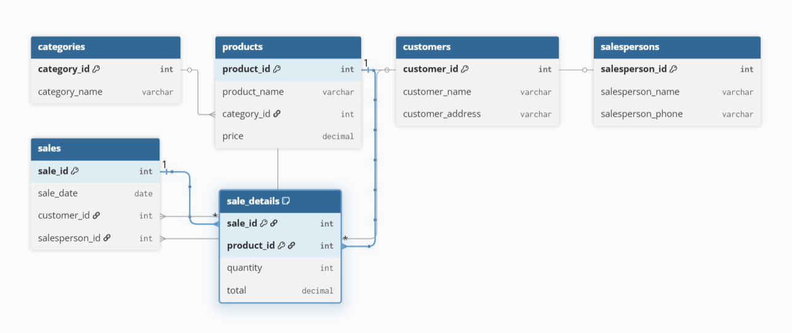
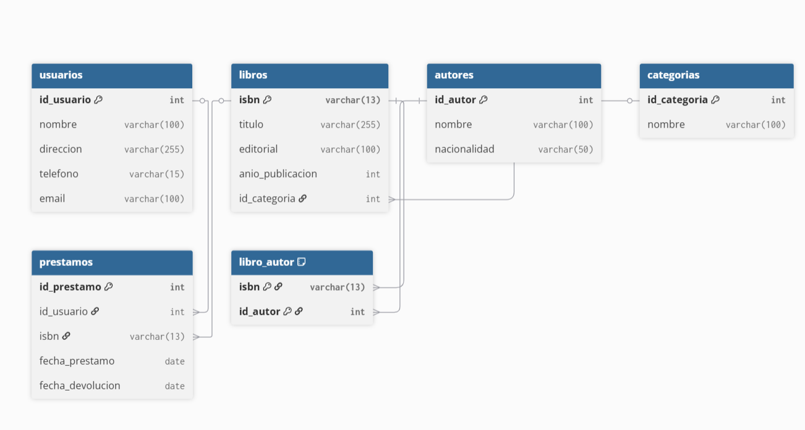

## kevin santiago larrota cuervo
## Parte 1: Análisis conceptual – Devart

1. ¿Qué problema principal busca resolver la normalización en una base de datos y por qué es crítica en sistemas empresariales?

La normalización busca evitar la repetición de datos y los errores que se pueden generar cuando la misma información está en varios lugares.
En una empresa esto es muy importante porque permite tener los datos organizados, confiables y fáciles de actualizar.
Por ejemplo, si un cliente cambia de dirección, con una base normalizada solo hay que actualizarla una vez, y ese cambio se verá en todo el sistema.

2. Describe con tus propias palabras las diferencias entre 1NF, 2NF y 3NF según los ejemplos del artículo.

Primera Forma Normal (1NF): los campos deben tener un solo valor. No se pueden guardar listas o varios datos en una misma celda.
*Ejemplo: si en una columna dice “Mesa, Silla, Sofá”, eso no cumple la 1NF porque hay varios valores juntos.

Segunda Forma Normal (2NF): además de cumplir la 1NF, los datos que no son clave deben depender de toda la clave primaria, no solo de una parte.
*Ejemplo: si la clave es (ID_Pedido, ID_Producto) y el nombre del producto solo depende del ID_Producto, hay una dependencia parcial y se debe separar.

Tercera Forma Normal (3NF): además de cumplir la 2NF, ningún campo que no sea clave debe depender de otro campo que tampoco es clave.
*Ejemplo: si la “Ciudad” depende del “Código Postal”, y este depende del cliente, hay una dependencia transitiva que se debe quitar creando otra tabla.

3️. En los ejemplos de Devart, identifica una situación donde la normalización mejora la integridad de datos, pero podría afectar el rendimiento. Explica el motivo.

Cuando se dividen las tablas grandes en varias más pequeñas, como “Clientes”, “Pedidos” y “Productos”, la información queda más organizada y confiable, pero el sistema puede volverse un poco más lento al hacer consultas.
Esto pasa porque para obtener toda la información se deben usar JOINs entre varias tablas, y eso puede tardar más, especialmente si la base de datos tiene muchos registros.

4️. Qué papel juegan las dependencias funcionales en el proceso de normalización y cómo las identificarías en una tabla?

Las dependencias funcionales ayudan a identificar qué datos dependen de otros dentro de una tabla.
Por ejemplo, si el ID_Cliente determina el nombre y el correo del cliente (ID_Cliente → Nombre, Correo), ahí hay una dependencia funcional.
Para encontrarlas, uno puede fijarse si cada vez que se repite un valor en una columna, también se repiten los valores relacionados en otras columnas.
Reconocerlas permite dividir correctamente las tablas y avanzar en las diferentes formas normales.

5️. Explica, con tus palabras, cuándo sería justificable “desnormalizar” una base de datos según el contexto de negocio.

La desnormalización se puede usar cuando lo más importante es la velocidad de las consultas, y no tanto mantener todo perfectamente normalizado.
Por ejemplo, en sistemas de reportes o análisis, o en páginas web donde se hacen muchas consultas pero pocos registros nuevos, es mejor tener algunos datos repetidos para que las búsquedas sean más rápidas.
En esos casos, se acepta un poco de redundancia a cambio de mejor rendimiento.

## Parte 2: Caso Fred’s Furniture

-- Reto 1 – Diagnóstico inicial

Descripción del reto:
La tabla original furniture_sales contenía información de ventas, productos, clientes y vendedores en una sola estructura. Este diseño presentaba múltiples problemas relacionados con la redundancia de datos y la dificultad para mantener la integridad de la información.

Anomalías identificadas:

Anomalía de inserción:
No se podía registrar un nuevo producto o cliente si aún no existía una venta asociada.
Esto se debía a que la tabla combinaba información de ventas, productos y clientes, lo que impedía la inserción independiente de cada entidad.

Anomalía de actualización:
Si cambiaba el teléfono de un vendedor, era necesario actualizarlo en todas las filas donde aparecía.
Esto ocurría porque la información del vendedor estaba repetida en cada registro de venta, lo que generaba redundancia y aumentaba el riesgo de inconsistencias.

Anomalía de eliminación:
Si se eliminaba una venta, también se perdía información del producto o cliente que podría seguir siendo útil.
La falta de separación entre las entidades provocaba la pérdida de datos valiosos al eliminar registros.

Decisiones tomadas:
Se decidió normalizar la base de datos hasta la Tercera Forma Normal (3FN) para resolver estas anomalías y mejorar la estructura de la base de datos.

-- Reto 2 – Aplicación de la Primera Forma Normal (1FN)

Descripción del reto:
El objetivo era garantizar que todos los campos fueran atómicos, es decir, que no contuvieran valores repetidos o multivaluados.

Decisiones tomadas:

Se identificaron las entidades principales: Clientes, Productos, Vendedores, Ventas y Detalles de Venta.

Cada entidad se representó en una tabla separada, eliminando la redundancia y asegurando la atomicidad de los datos.

Código SQL relevante:

CREATE TABLE Customers (
    customer_id INT AUTO_INCREMENT PRIMARY KEY,
    customer_name VARCHAR(100),
    customer_address VARCHAR(200)
);

CREATE TABLE Salespersons (
    salesperson_id INT AUTO_INCREMENT PRIMARY KEY,
    salesperson_name VARCHAR(100),
    salesperson_phone VARCHAR(50)
);

CREATE TABLE Products (
    product_id INT AUTO_INCREMENT PRIMARY KEY,
    product_name VARCHAR(100),
    price DECIMAL(10,2)
);

CREATE TABLE Sales (
    sale_id INT AUTO_INCREMENT PRIMARY KEY,
    sale_date DATE,
    customer_id INT,
    salesperson_id INT,
    FOREIGN KEY (customer_id) REFERENCES Customers(customer_id),
    FOREIGN KEY (salesperson_id) REFERENCES Salespersons(salesperson_id)
);

CREATE TABLE Sale_Details (
    sale_id INT,
    product_id INT,
    quantity INT,
    total DECIMAL(10,2),
    PRIMARY KEY (sale_id, product_id),
    FOREIGN KEY (sale_id) REFERENCES Sales(sale_id),
    FOREIGN KEY (product_id) REFERENCES Products(product_id)
);

-- Reto 3 – Aplicación de la Segunda Forma Normal (2FN)

Descripción del reto:
El objetivo era eliminar las dependencias parciales, es decir, asegurarse de que todos los atributos no clave dependieran completamente de la clave primaria.

Decisiones tomadas:

Se identificaron dependencias parciales en la tabla Sale_Details, donde algunos atributos dependían solo de una parte de la clave compuesta (sale_id, product_id).

Se crearon tablas adicionales para representar correctamente las relaciones entre las entidades y eliminar las dependencias parciales.

Código SQL relevante:

CREATE TABLE Categories (
    category_id INT AUTO_INCREMENT PRIMARY KEY,
    category_name VARCHAR(100)
);

ALTER TABLE Products
ADD COLUMN category_id INT,
ADD FOREIGN KEY (category_id) REFERENCES Categories(category_id);

-- Reto 4 – Aplicación de la Tercera Forma Normal (3FN)

Descripción del reto:
El objetivo era eliminar las dependencias transitivas, es decir, asegurarse de que los atributos no clave no dependieran de otros atributos no clave.

Decisiones tomadas:

Se identificaron dependencias transitivas en la tabla Products, donde atributos como category_name dependían de la categoría, que a su vez dependía del producto.

Se reorganizó la estructura de las tablas para eliminar estas dependencias y garantizar que cada atributo dependiera directamente de la clave primaria.

Código SQL relevante:

CREATE TABLE Categories (
    category_id INT AUTO_INCREMENT PRIMARY KEY,
    category_name VARCHAR(100)
);

CREATE TABLE Products (
    product_id INT AUTO_INCREMENT PRIMARY KEY,
    product_name VARCHAR(100),
    price DECIMAL(10,2),
    category_id INT,
    FOREIGN KEY (category_id) REFERENCES Categories(category_id)
);

 
diagrama E-R final 

### Reglas de negocio

Reglas de Negocio Derivadas

Cada venta debe estar asociada a un cliente y a un vendedor.

Justificación: La tabla Sales requiere las claves foráneas customer_id y salesperson_id, lo que implica que no se pueden registrar ventas sin asignarles un cliente y un vendedor específicos.

Cada detalle de venta debe asociar un producto con una venta específica.

Justificación: La tabla Sale_Details utiliza las claves foráneas sale_id y product_id, lo que significa que no se pueden registrar detalles de ventas sin vincularlos a una venta y un producto existentes.

La cantidad de productos vendidos debe ser un número entero positivo.

Justificación: El campo quantity en la tabla Sale_Details está definido como INT, lo que implica que solo se pueden registrar cantidades enteras y positivas de productos vendidos.

El total de la venta debe ser calculado como el producto del precio del producto por la cantidad vendida.

Justificación: El campo total en la tabla Sale_Details refleja el cálculo de quantity * price, lo que asegura que el total registrado sea siempre coherente con la cantidad y el precio del producto.

Cada producto debe pertenecer a una categoría específica.

Justificación: La tabla Products incluye la clave foránea category_id, lo que indica que cada producto debe estar asignado a una categoría existente en la tabla Categories.

El precio de cada producto debe ser un valor numérico positivo.

Justificación: El campo price en la tabla Products está definido como DECIMAL(10,2), lo que permite almacenar precios con dos decimales, asegurando que solo se registren valores numéricos positivos para el precio de los productos.

No se pueden registrar productos con el mismo nombre en la misma categoría.

Justificación: Aunque no se especifica una restricción explícita en el modelo, es una práctica común en bases de datos comerciales evitar duplicados de productos con el mismo nombre en una categoría para mantener la unicidad y facilitar la gestión del inventario.

Los datos de clientes y vendedores deben ser actualizados en todas las ventas asociadas.

Justificación: Cualquier cambio en la información de un cliente o vendedor debe reflejarse en todas las ventas asociadas a ellos, manteniendo la consistencia de los datos en el sistema.

No se deben permitir ventas sin productos asociados.

Justificación: La existencia de registros en la tabla Sale_Details es obligatoria para cada venta en la tabla Sales, lo que garantiza que todas las ventas tengan productos asociados.

Cada categoría debe tener un nombre único.

Justificación: La tabla Categories utiliza category_id como clave primaria, lo que implica que cada categoría debe tener un identificador único. Aunque no se especifica una restricción de unicidad en el nombre, es recomendable que cada categoría tenga un nombre único para evitar confusiones.

### Justificación del diseño

1. Eliminación de redundancias y anomalías

El diseño inicial de la tabla furniture_sales presentaba múltiples problemas, como la duplicación de datos y la dificultad para realizar actualizaciones sin inconsistencias. Al aplicar la normalización hasta la 3FN, se logró:

Reducción de redundancias: Los datos se distribuyeron en tablas específicas, evitando la repetición innecesaria de información.

Minimización de anomalías: Se eliminaron las anomalías de inserción, actualización y eliminación, garantizando la integridad de los datos.

2. Mejora en la integridad referencial

La implementación de claves primarias y foráneas en las tablas asegura que las relaciones entre las entidades sean coherentes y que no existan registros huérfanos o inconsistentes. Por ejemplo, la relación entre Sales y Customers se mantiene mediante la clave foránea customer_id, garantizando que cada venta esté asociada a un cliente válido.

3. Optimización del rendimiento

Aunque la normalización puede aumentar el número de tablas, también mejora el rendimiento de las consultas al reducir la cantidad de datos redundantes y facilitar el uso de índices. Esto se traduce en tiempos de respuesta más rápidos y una mayor eficiencia en las operaciones de la base de datos.

4. Escalabilidad y mantenimiento

Un diseño normalizado facilita la expansión del sistema y la incorporación de nuevas funcionalidades sin comprometer la estructura existente. Además, permite un mantenimiento más sencillo, ya que los cambios en una entidad (como la actualización de la información de un cliente) se reflejan automáticamente en todas las tablas relacionadas.

5. Cumplimiento de las formas normales

El proceso de normalización hasta la 3FN se llevó a cabo siguiendo las siguientes etapas:

Primera Forma Normal (1FN): Se eliminaron los grupos repetitivos y se aseguraron atributos atómicos, garantizando que cada campo contenga un solo valor.

Segunda Forma Normal (2FN): Se eliminaron las dependencias parciales, asegurando que todos los atributos dependan completamente de la clave primaria.

Tercera Forma Normal (3FN): Se eliminaron las dependencias transitivas, asegurando que no existan atributos no clave que dependan de otros atributos no clave.

Este enfoque estructurado asegura que la base de datos sea eficiente, coherente y fácil de mantener a largo plazo.

## Parte 3: Proyecto personal

Sistema de Gestión Bibliotecaria: Administración de Libros, Usuarios y Préstamos

## resumen 

Este proyecto consiste en el diseño e implementación de una base de datos relacional destinada a la gestión eficiente de una biblioteca. El sistema permite almacenar y organizar información sobre libros, usuarios y préstamos, facilitando así el control de las colecciones bibliográficas y el seguimiento de los materiales prestados. A través de un modelo de datos normalizado hasta la tercera forma normal (3FN), se busca garantizar la integridad, consistencia y eficiencia en las operaciones de consulta y actualización de los datos.

## modelo E-R conceptual y lógico.

### Reglas de negocio 

Las reglas de negocio son directrices que definen y restringen las operaciones, definiciones y relaciones dentro del sistema. Son esenciales para garantizar la coherencia y la integridad de los datos. A continuación, se detallan las principales reglas aplicadas en este proyecto:

Identificación única de usuarios: Cada usuario debe tener un identificador único (id_usuario) para garantizar la integridad referencial y evitar duplicados.

Unicidad de libros: Cada libro se identifica de manera única por su isbn, asegurando que no existan registros duplicados de un mismo libro.

Relación muchos a muchos entre libros y autores: Un libro puede tener múltiples autores y un autor puede haber escrito varios libros. Esta relación se maneja mediante una tabla intermedia libro_autor, que contiene las claves foráneas isbn y id_autor.

Clasificación de libros: Cada libro pertenece a una categoría específica, identificada por id_categoria, lo que permite una organización eficiente del catálogo.

Préstamos de libros: Un usuario puede realizar múltiples préstamos, pero cada préstamo se refiere a un solo libro. La tabla prestamos registra la relación entre id_usuario y isbn, junto con las fechas de préstamo y devolución.

Restricciones de fechas: La fecha de devolución de un préstamo debe ser posterior a la fecha de préstamo, garantizando la lógica temporal de las operaciones.

Integridad referencial: Se implementan claves foráneas entre las tablas para asegurar que las relaciones entre entidades sean consistentes y válidas.

## Justificación del Diseño

El diseño de la base de datos se ha realizado siguiendo principios fundamentales de normalización y modelado de datos, con el objetivo de optimizar el almacenamiento, la integridad y la eficiencia en las consultas. A continuación, se detallan las decisiones clave:

Normalización hasta la 3FN: Se ha aplicado la normalización hasta la tercera forma normal (3FN) para eliminar redundancias y dependencias no deseadas, asegurando una estructura de datos eficiente y libre de anomalías.

Uso de claves primarias y foráneas: Cada tabla cuenta con una clave primaria que identifica de manera única cada registro. Las claves foráneas se utilizan para establecer relaciones entre tablas, garantizando la integridad referencial y facilitando las consultas JOIN.

Tabla intermedia para relaciones muchos a muchos: La relación entre libros y autores se maneja mediante la tabla libro_autor, que permite asociar múltiples autores a un libro y viceversa, sin redundancias.

Optimización para consultas comunes: El diseño permite consultas eficientes para operaciones frecuentes, como la búsqueda de libros por categoría, la consulta de préstamos activos de un usuario y la obtención de información detallada de un libro junto con sus autores.

Escalabilidad y mantenimiento: La estructura modular y normalizada facilita la expansión del sistema, la incorporación de nuevas funcionalidades y el mantenimiento a largo plazo sin comprometer la integridad de los datos.

