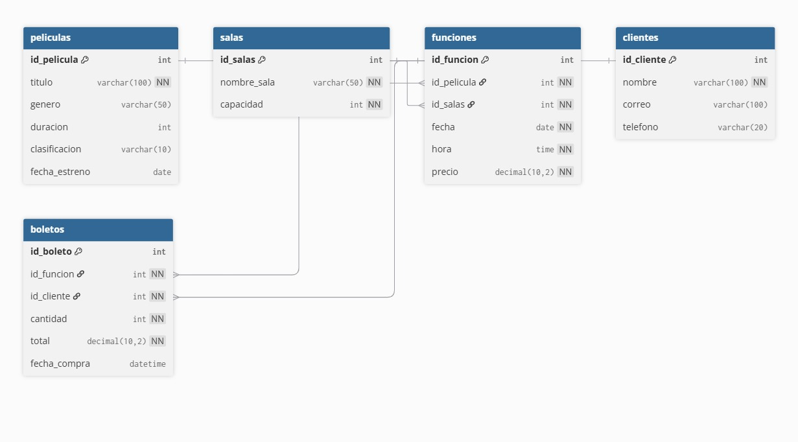

## hecho por Yeison Moreno Kevin Larrota Juan Zacananbui Juan Cuadros 

## Base de Datos de Cine — MySQL

## Descripción general

Este proyecto forma parte de la Actividad 
Integradora: “Del Modelo al Script – Construcción de 
Bases de Datos Reales en SQL”.
El objetivo es diseñar e implementar una base de 
datos relacional completa en MySQL, aplicando los
conceptos aprendidos sobre modelado, normalización,
integridad referencial y manipulación de datos.

El sistema representa la gestión de un cine,
permitiendo administrar películas, salas, funciones,
clientes y boletos vendidos.

## Modelo conceptual y lógico

El diseño parte del modelo entidad–relación (E-R) que representa las entidades principales del negocio y sus relaciones.

-Entidades principales:
-Películas: información de las películas en cartelera.
-Salas: datos de las salas de proyección.
-Funciones: combina película, sala, fecha y hora.
-Clientes: datos de los compradores de boletos.
-Boletos: registro de las compras realizadas.

Relaciones principales:

-Una película puede tener muchas funciones.
-Una sala puede proyectar muchas funciones.
-Un cliente puede comprar varios boletos.
-Una función puede tener muchos boletos vendidos.

## Construcción física en MySQL

El modelo se implementó en MySQL utilizando sentencias DDL (CREATE, ALTER) y DML (INSERT)
 para definir las tablas, restricciones e insertar datos de ejemplo.
 
 

Tablas creadas:
-peliculas
-salas
-funciones
-clientes
-boletos

Cada tabla incluye su clave primaria (PK) y claves foráneas (FK) con las acciones ON DELETE 
CASCADE y ON UPDATE CASCADE para mantener la integridad referencial.

## Carga de datos de ejemplo

Se agregaron registros de muestra para validar la estructura y relaciones:
-3 películas
-3 salas
-3 funciones
-3 clientes
-3 boletos vendidos
